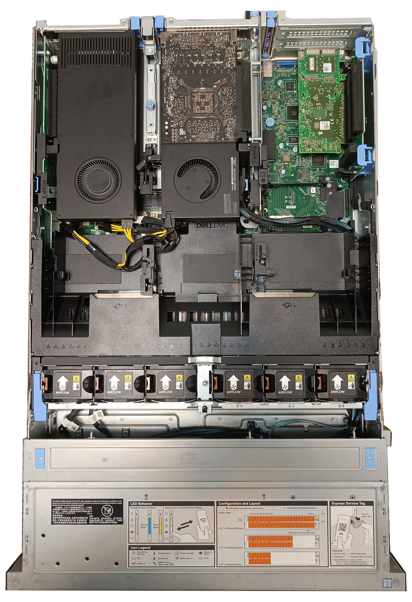
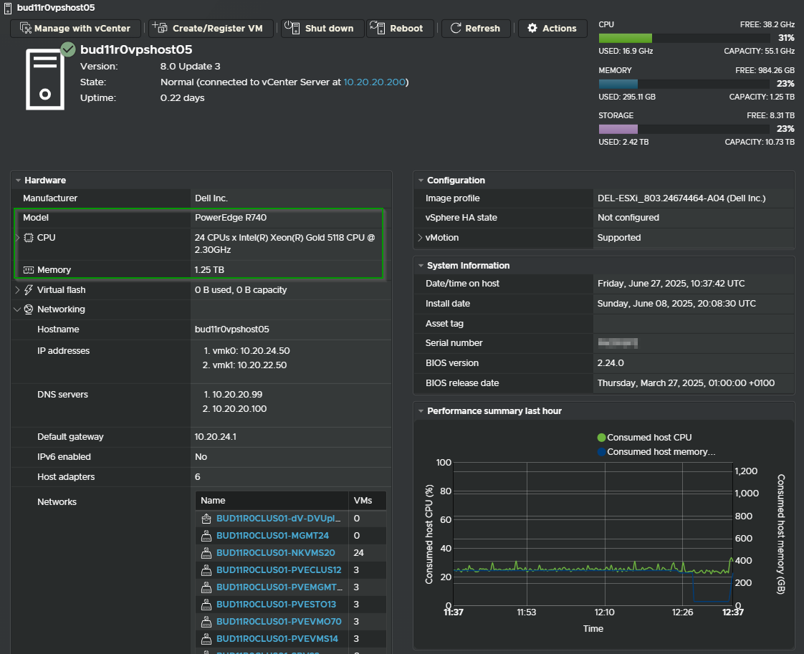
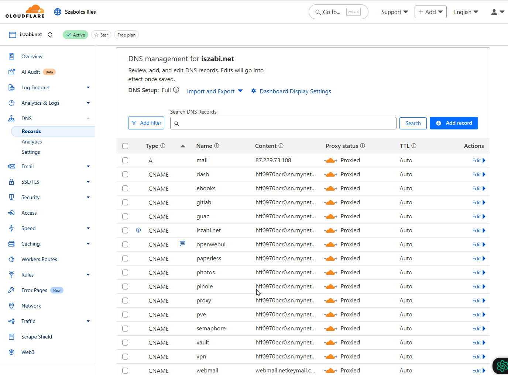
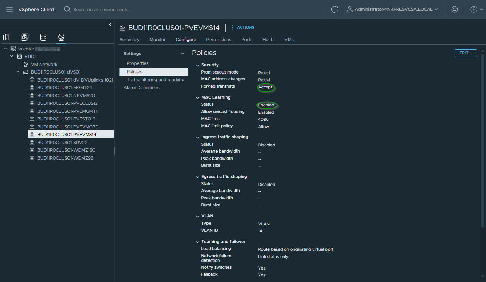

## Table of Contents

1. [How to build a private local AI server with Proxmox, Ollama, Open WebUI for using ChatGPT?](#title-1)
1.1 [Hardware requirements overview](#1.1)
1.2 [Installing WebUi and Ollama LXC](#1.2)
1.3 [Subheading 3](#1.3)

<!-- headings -->

# 1. How to build a private local AI server with Proxmox, Ollama, Open WebUI for using ChatGPT?

Over the last few years Proxmox Virtual Environment (PVE) has been gaining a lot of interest as a way of easily managing virtual machines and container images using Open-Source software and the Linux KVM hypervisor.
In my AI home lab I was used the latest (v8.4.1) PVE environment including advanced networking and storage inside by VMWARE ESXi-based v8.0 U3 infrastructure.

## 1.1. Hardware requirements overview

PVE Cluster built on Enterprise grade server from Dell PowerEdge family.

| NODE | MODEL     | CPU                                 | RAM   | STORAGE                        | OOB MGMT | NETWORK                  |
|------|-----------|-------------------------------------|-------|-------------------------------|-----------|--------------------------|
| pve1 | Dell R740 | 2 x Xeon Gold 5128 2.3 GHz (24 Cores) | 1.2 TB | 8 x 3.84 TB SSDs (in RAID10)   | iDRAC 9   | 4 x 10 GbE, 2 x 25 GbE   |
| pve2 | Dell R740 | 2 x Xeon Gold 5128 2.3 GHz (24 Cores) | 1.2 TB | 8 x 3.84 TB SSDs (in RAID10)   | iDRAC 9   | 4 x 10 GbE, 2 x 25 GbE   |
| pve3 | Dell R740 | 2 x Xeon Gold 5128 2.3 GHz (24 Cores) | 1.2 TB | 8 x 3.84 TB SSDs (in RAID10)   | iDRAC 9   | 4 x 10 GbE, 2 x 25 GbE   |

 
- **Platform** - To build a virtual PVE cluster I need a suitable host or host cluster, either as physical hardware or running a hypervisor which supports nested environments. 
I built the PVE nodes as vSphere VMs. My AI Platform currently has 3 ESXi 8.0U3 hosts managed by a vCenter instance connected to a DVS switch, but the process described should work for single hosts as well as clustered environments.

- **DNS** - I configured two Internal DNS servers for PVE host servers and allocated IP addressing for these prior to deploying the VMs. 
The iszabi.net main Public domain DNS and its related secure settings are managed in Cloudflare (cloudflare.com). Requested subdomains (openwebui.iszabi.net, pve.iszabi.net, poxy.iszabi.net) are redirected to my ISP Router as well. 

- **VM Networking** - This is the most important one! In order for VMs running inside the PVE hosts to connect to the 'real' network I needed to setup PortGroup defined in vCenter configuration with both 'MAC Learning' and 'Forged Transmits' enabled. This is necessary so that the virtual MAC addresses assigned by PVE to VMs and containers are allowed to transit the PortGroup.

- **Storage** - PVE can use existing network storage, but I configured Ceph clustered storage within the PVE environment the easiest way to do this is to add an additional 'local' disk to each PVE VM which can then be used to form a cluster across the PVE VMs deployed. Having shared storage for PVE allows fast live-migration of VMs between the virtual PVE hosts.

## 1.2. Installing WebUi and Ollama LXC